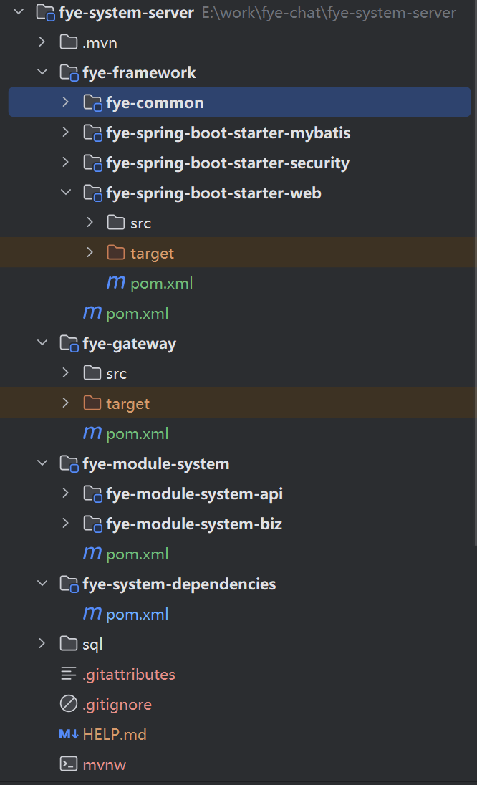
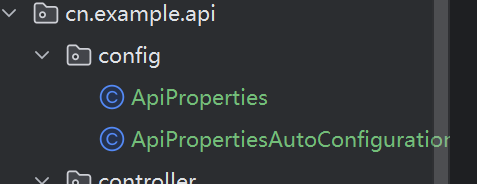

# FyeSystem server开发笔记

## 项目初始化

项目的初始结构，使用fye-system-dependencies管理包版本，在fye-framework定义starter，使用module来定义模块，如fye-module-system。在fye-module-system-biz定义模块内的功能，在fye-module-system-api中定义需要export的功能。



## 在项目中使用Knif4j+OpenApi集成Api文档。

::: tip

知识背景！！！

本文设计SpringBoot自动配置原理，请预先进行了解。

[Auto-configuration :: Spring Boot](https://docs.spring.io/spring-boot/reference/using/auto-configuration.html)

:::

在fye-spring-boot-starter-web中引入文档相关开发包。

pom.xml

```xml
<?xml version="1.0" encoding="UTF-8"?>
<project xmlns="http://maven.apache.org/POM/4.0.0"
         xmlns:xsi="http://www.w3.org/2001/XMLSchema-instance"
         xsi:schemaLocation="http://maven.apache.org/POM/4.0.0 http://maven.apache.org/xsd/maven-4.0.0.xsd">
    <packaging>jar</packaging>
    <groupId>cn.fye.example</groupId>
    <artifactId>Knif4JOpenApi</artifactId>
    <version>1.0.0</version>
    <modelVersion>4.0.0</modelVersion>
    <properties>
        <project.build.sourceEncoding>UTF-8</project.build.sourceEncoding>
        <maven.compiler.source>17</maven.compiler.source>
        <maven.compiler.target>17</maven.compiler.target>
    </properties>
    <parent>
        <artifactId>spring-boot-starter-parent</artifactId>
        <groupId>org.springframework.boot</groupId>
        <version>3.2.0</version>
    </parent>

    <dependencies>
        <dependency>
            <groupId>org.springframework.boot</groupId>
            <artifactId>spring-boot-starter-web</artifactId>
        </dependency>
        <!-- Swagger3-knife4j依赖 -->
        <dependency>
            <groupId>com.github.xiaoymin</groupId>
            <artifactId>knife4j-openapi3-jakarta-spring-boot-starter</artifactId>
            <version>4.3.0</version>
        </dependency>
    </dependencies>
</project>
```

自定义starter配置Info信息




ApiProperties.java

```java
private Boolean enable;
/**
 * 标题
 */
private String title;
/**
 * 描述
 */
private String description;
/**
 * 作者
 */
private String author;
/**
 * 版本
 */
private String version;

public Boolean getEnabled() {
    return enable;
}

public void setEnabled(Boolean enabled) {
    this.enable = enabled;
}

public String getTitle() {
    return title;
}

public void setTitle(String title) {
    this.title = title;
}

public String getVersion() {
    return version;
}

public void setVersion(String version) {
    this.version = version;
}

public String getDescription() {
    return description;
}

public void setDescription(String description) {
    this.description = description;
}

public String getAuthor() {
    return author;
}

public void setAuthor(String author) {
    this.author = author;
}
```

ApiPropertiesAutoConfiguration.java

```java
package cn.example.api.config;

import io.swagger.v3.oas.models.OpenAPI;
import io.swagger.v3.oas.models.info.Contact;
import io.swagger.v3.oas.models.info.Info;
import org.springframework.boot.autoconfigure.AutoConfiguration;
import org.springframework.boot.autoconfigure.condition.ConditionalOnProperty;
import org.springframework.boot.context.properties.EnableConfigurationProperties;
import org.springframework.context.annotation.Bean;

/**
 * @Author: Fly
 * @CreateTime: 2025-03-17
 * @Version: 1.0
 */
@AutoConfiguration
@EnableConfigurationProperties(ApiProperties.class)
@ConditionalOnProperty(prefix = "api.custom", name = "enable", havingValue = "true", matchIfMissing = false)
public class ApiPropertiesAutoConfiguration {
    @Bean
    public OpenAPI CustomOpenAPIInfo(ApiProperties apiProperties) {
        System.out.println(apiProperties.getTitle());
        return new OpenAPI()
                .info(new Info().title(apiProperties.getTitle())
                        .description(apiProperties.getDescription())
                        .version(apiProperties.getVersion())
                        .contact(new Contact().name(apiProperties.getAuthor()))
                );
    }
}
```

建立org.springframework.boot.autoconfigure.AutoConfiguration.imports文件,并写入以下内容

```
cn.example.api.config.ApiPropertiesAutoConfiguration
```

在controller中使用注解定义Api信息

```java
package cn.example.api.controller;

import cn.example.api.dal.User;
import cn.example.api.service.UserService;
import io.swagger.v3.oas.annotations.Operation;
import io.swagger.v3.oas.annotations.tags.Tag;
import jakarta.annotation.Resource;
import org.springframework.web.bind.annotation.GetMapping;
import org.springframework.web.bind.annotation.RequestMapping;
import org.springframework.web.bind.annotation.RequestParam;
import org.springframework.web.bind.annotation.RestController;

/**
 * @Author: Fly
 * @CreateTime: 2025-03-17
 * @Version: 1.0
 */
@RestController
@RequestMapping("user")
@Tag(name = "user")
public class UserController {
    @Resource
    UserService userService;

    @Operation(summary = "获取用户",description = "根据用户名获取用户")
    @GetMapping("get")
    public User getUser(@RequestParam("name") String name) {
        return userService.getUserByUsername(name);
    }
}
```

### 常用注解

[官网连接](https://link.wtturl.cn/?target=https%3A%2F%2Fspringdoc.org%2F%23migrating-from-springfox&scene=im&aid=497858&lang=zh)

@Tag(name=“  ”) 分组注解

标记在controller的类上，常用属性为name。作用是将controller类加入到对应标签下进行分组。

@Operation(summary=“”) 请求方法注解

标记在请求方法上，常用属性为summary。用户描述Api的操作。

@Parameter(name = "id", description = "编号", required = true, example = "1024")

描述方法的参数

## 全局响应和异常处理

::: tip

知识背景！！！

CommonResult类可以定义全局响应内容。

@RestControllerAdvice注解配合@ExceptionHandler(Exception.class)注解可以拦截异常，可以在GlobalErrorCodeConstants类中定义错误常量。

:::

内容较为简单，详情关注CommonResult和GlobalExceptionHandler这两个类。

## 搭建RBAC权限模型


## 引入SpringSecurity进行授权验证

([认证（Authentication） :: Spring Security Reference](https://springdoc.cn/spring-security/features/authentication/index.html))


